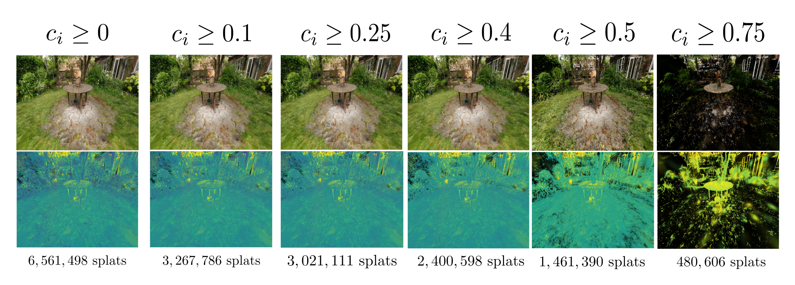
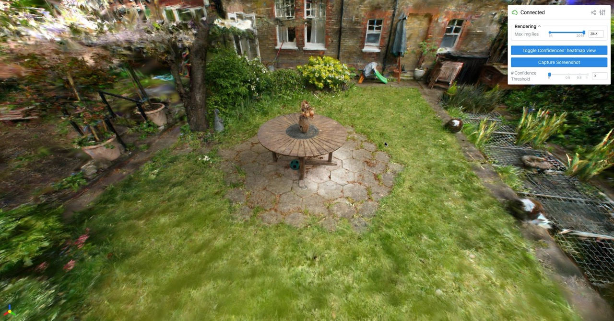
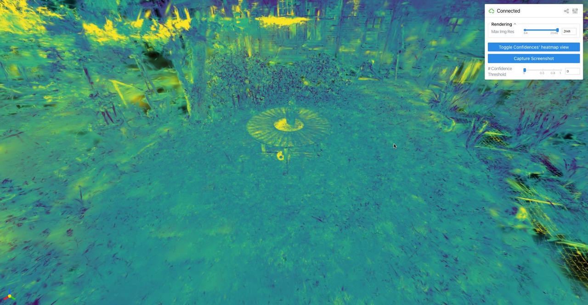

# Confident Splatting
Official PyTorch implementation of ["Confident Splatting: Confidence-Based Compression of 3D Gaussian Splatting via Learnable Beta Distributions"](https://arxiv.org/pdf/2506.22973) 

By [AmirHossein Razlighi](https://scholar.google.com/citations?user=JbQgt-QAAAAJ&hl=en), [Elaheh Badali](https://openreview.net/profile?id=~Elaheh_Badali_Golezani1) , [Shohreh Kasaei](https://scholar.google.com/citations?user=mvx4PvgAAAAJ&hl=en)

3D Gaussian Splatting enables high-quality real-time rendering but often produces millions of splats, resulting in excessive storage and computational overhead. We propose a novel lossy compression method based on learnable confidence scores modeled as Beta distributions. Each splat's confidence is optimized through reconstruction-aware losses, enabling pruning of low-confidence splats while preserving visual fidelity. The proposed approach is architecture-agnostic and can be applied to any Gaussian Splatting variant. In addition, the average confidence values serve as a new metric to assess the quality of the scene. Extensive experiments demonstrate favorable trade-offs between compression and fidelity compared to prior work.

<p align="center">

</p>

## Environment Setup

You can create your environment using conda or pip by the following commands.

For conda:
```bash
conda env create -f requirements/environment.yml
```

For pip:
```bash
pip install -r requirements/requirements.txt
```

## Data
The dataset convention used in this model follows the dataset convention in the main Gaussian Splatting repository and also gsplats. You need an SFM initialization from a set of images (with camera poses) with `sparse/ , stereo/ , images/` folders inside it. Also, if you want, you can simply put your set of images in a folder named `input/` and run the following command:
```bash
python3 convert.py -s {path_to_your_dataset_folder} --resize
```

use `--resize` if you want to also store other resolutions (divided by 2, 4, and 8) as well as the original resolution of your images.

You can also use the well-known datasets like Mip-NeRF-360, Tanks&Temples, ZipNeRF and etc. Some of these datasets are available for you to download via the following command:
```bash
python3 datasets/download_dataset.py
```

Also, you can download the "Confident-Splatting" dataset scenes from [Google Drive](https://drive.google.com/drive/folders/1jK7ENuUULUB6VdXWUrHIsFiXeQbfIrOq?usp=sharing) and also [Huggingface(HF) Datasets](https://huggingface.co/datasets/AmirHossein-razlighi/Confident_Splatting).

## Training
For training a Confident-Splatting model (with learned confidence scores per-splat), you can run the following command:
```bash
python3 trainer.py {default | mcmc} --data_dir {path_to_your_dataset} --result_dir {path_to_where_to_store_logs_and_results} --use_conf_scores
```

You can also specify the following arguments:
```bash
--rank_interval {X}
--rank_pairs {Y}
--beta_ent {B}
--lambda_sparsity {L}
```
Where `rank-interval` is how frequently (in terms of epochs) should we do the __saliency-based ranking loss__. Also, `--rank-pairs` is for "how many splats should we sample for computing saliency-based ranking loss". `--beta-ent` stands for the multiplier of _Entropy loss_ and `--lambda-sparsity` stands for the multiplier of _Sparsity loss_.

After the training ends, you can see the logs and results in your specified path. Also, there will be side-by-side renders of the images in `renders/` and a video rendered from the whole scene in `videos/`. Also your saved checkpoints will be stored in `ckpts/`. In the meanwhile, while the model is training, you can see the custom viewer for the gaussian splatting scene automatically openning in your browser.

> [!NOTE]  
> You can use "default" for using original 3dgs method or "mcmc" for using MCMC method. Or you can even implement and use your own method, simply by calling its name (after implementing it)! Confident Splatting will work on it with no change in your main pipeline.

## Evaluation
For evaluating your scene, and applying different threhsolds on it automatically and generating plots (PSNR vs Num of Splats) and a csv file containing all metrics, you can simply do the following:

```bash
python3 trainer.py {default | mcmc} --data_dir {path_to_your_dataset} --result_dir {path_to_where_to_store_logs_and_results} --use_conf_scores --ckpt {path_to_your_specific_checkpoint}
```
It will produce logs (metrics) based on sweeping on the threhsold for confidence score in evaluation (test) mode and print the results. Also, in your `result-dir` you will see a new folder named `plots/` in which you can see plots of the quality-size trade-off and also a csv file containing all metrics and threhsolds. If you want to specify a cretain threshold value, you can do it by:
```bash
python3 trainer.py {default | mcmc} --data_dir {path_to_your_dataset} --result_dir {path_to_where_to_store_logs_and_results} --use_conf_scores --ckpt {path_to_your_specific_checkpoint} --eval_conf_thresh {thresh}
```

## Visualization
For visualizing the trained scene and watching the confidence scores heatmaps and change the threshold interactively and see the remaining splats, you can run the following command:
```bash
python3 viewer.py --output_dir {path_to_desired_output_dir} --ckpt {path_to_your_checkpoint} 
```
and you will see something like the following:



and you can set a threshold on confidence score or switch to heatmap mode to see which splats are more confident than the others!


